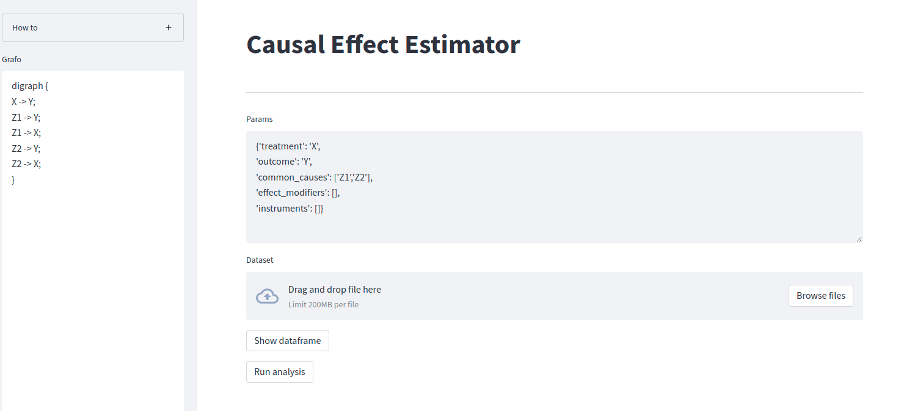
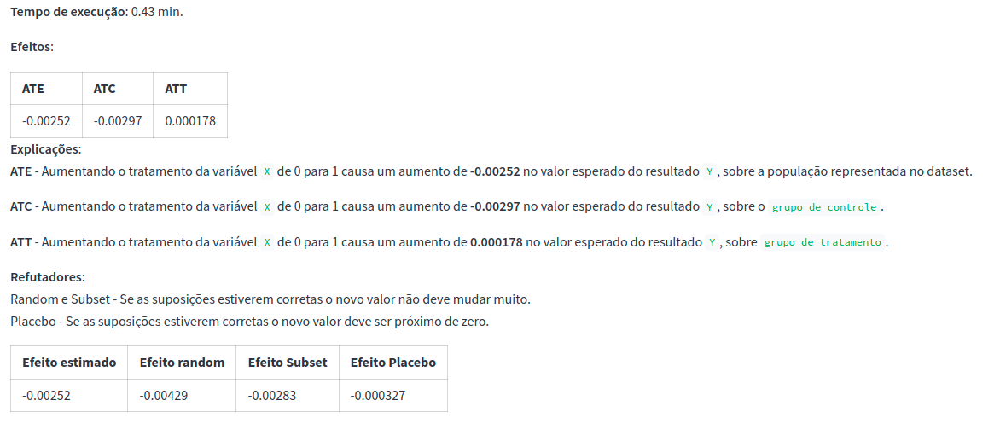

# Causal Estimator

This is a simple application to estimate causal effect based on a causal graph. It makes use of (streamlit)[https://streamlit.io/] for the UI and Microsoft's (DoWhy)[https://microsoft.github.io/dowhy/] for inference.

Usage:
- Build and run the docker image
```shell
docker build . -t causalestimator:1.0
docker run causalestimator:1.0
```

- The application will be available in the url shown in the log
- At the UI you can import your csv file with the treatment, outcome and confounders features
- Build your causal graph at http://dagitty.net/dags.html and edit it to the format shown in the left panel



- Finally hit `Run analysis`. 

**Unfortunatelly the text in the UI is in Portuguese. I will change it to English soon.**

